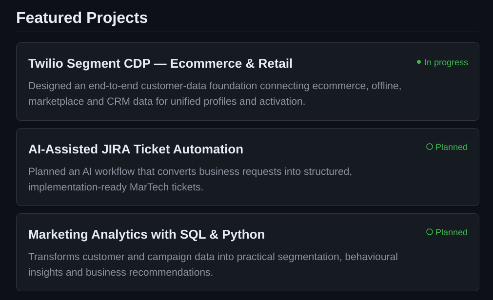
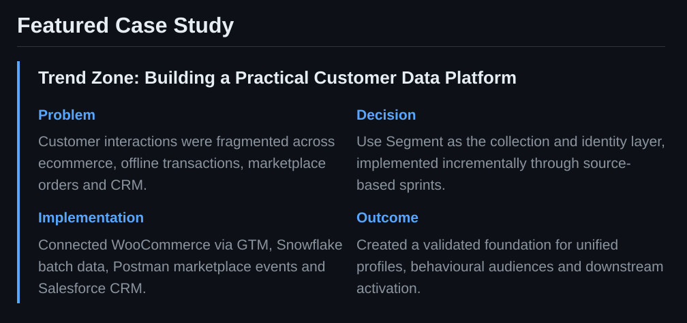
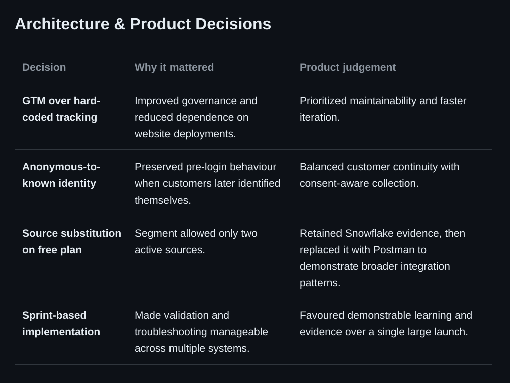
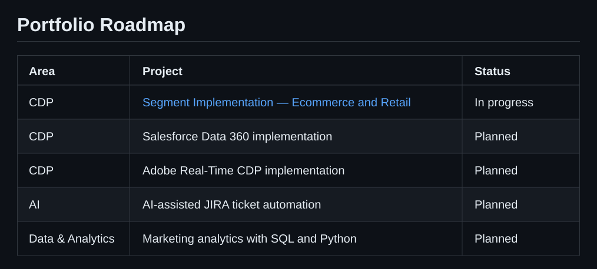

# Marketing Technology Portfolio

### Technical + Product Thinking for Business Problem Solving

I design customer-data architectures and practical marketing technology solutions that connect **CDP**, **AI**, and **data analytics** to measurable customer and business outcomes.

&nbsp;&nbsp;&nbsp;&nbsp;&nbsp;&nbsp;

---

## About Me

I work at the intersection of **marketing, customer data, and technology**. My focus is translating business requirements into scalable customer-data architectures, identity strategies, audience frameworks, and activation use cases.

This portfolio documents not only what I build, but also the **problems, decisions, trade-offs, validation, and product judgement** behind each solution.

---

<table>
<tr>
<td width="33%" valign="top">

### 🗄️ CDP Projects

Customer data architecture, data collection, identity resolution, Customer 360, audience design, and activation.

**Platforms**

- Twilio Segment
- Salesforce Data 360
- Adobe Real-Time CDP

</td>
<td width="33%" valign="top">

### 🤖 AI Projects

Marketing automation and applied AI solutions designed around genuine business and operational needs.

**Focus areas**

- Marketing automation
- AI-assisted workflows
- Practical AI solutions

</td>
<td width="33%" valign="top">

### 📊 Data & Analytics

Marketing and customer analysis using data modelling, SQL, Python, and clear business interpretation.

**Focus areas**

- Data analysis
- SQL
- Python

</td>
</tr>
</table>

---

[Twilio Segment CDP — Ecommerce & Retail](https://github.com/prabirbera23/segment-cdp-for-ecommerce-retail) · AI-Assisted JIRA Ticket Automation *(Planned)* · Marketing Analytics with SQL & Python *(Planned)*

---

**[Explore the complete Trend Zone case study →](https://github.com/prabirbera23/segment-cdp-for-ecommerce-retail)**

---

**[Explore the architecture and implementation decisions →](https://github.com/prabirbera23/segment-cdp-for-ecommerce-retail)**

---

**[Explore the portfolio repositories →](https://github.com/prabirbera23?tab=repositories)**

---

## Certifications

- Salesforce Marketing Cloud Email Specialist
- Salesforce Pardot Specialist
- Braze Certified Practitioner

---

## Technology

`Twilio Segment` · `Braze` · `HubSpot` · `Salesforce` · `Snowflake` · `Google Tag Manager` · `Postman` · `SQL` · `Python`

---

## What This Portfolio Demonstrates

- Translating business problems into data and technology solutions
- Designing customer-data collection and integration architectures
- Implementing event tracking and identity strategies
- Connecting technical implementation with marketing use cases
- Making and documenting product decisions and trade-offs
- Recording validation evidence, limitations, and business impact

---

### Marketing Technology · Customer Data Platforms · AI · Data & Analytics

